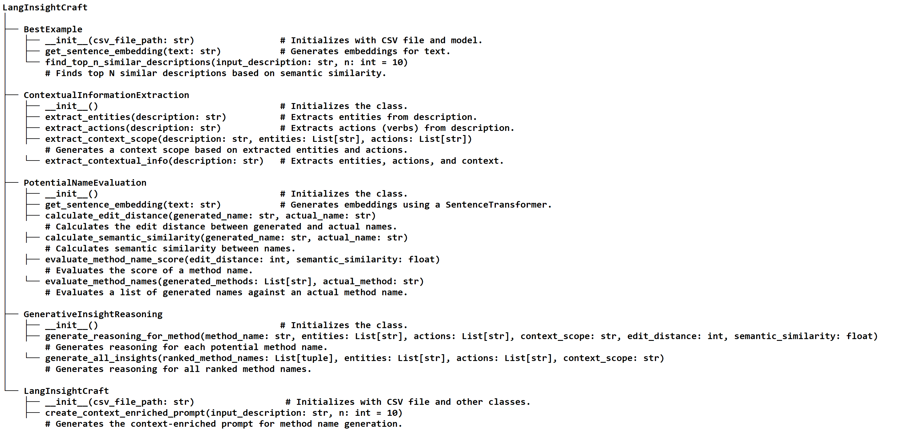

# Replication package for the paper: "A Cross-Language Approach to Recommending Method Names According to Functional Descriptions"

# Introduction:
This paper introduces a novel approach to automatically suggesting high-quality Java method names using large language models (LLMs). Leveraging LLMs' advanced understanding capabilities for natural language descriptions of method functionalities, this approach introduces an algorithm called LangInsightCraft to generate context-enriched prompts that align generated names with established naming conventions, enhancing code readability and maintainability.
# Datasets:
There are two datasets are used to evalatute the approach
- [English Dataset:](https://github.com/waseemakram36602/LLM-Based-Namer/tree/main/Datasets/English-Dataset) Method Names with English Functional Descriptions (Dataset of Baseline).
- [Chinese Dataset:](https://github.com/waseemakram36602/LLM-Based-Namer/tree/main/Datasets/Chinese-Dataset) Method Names with Chinese Functional Descriptions. The Dataset organized from [Java 11 API Reference](https://www.apiref.com/java11-zh/java.base/module-summary.html)
- [Unseen Dataset:](https://github.com/waseemakram36602/LLM-Based-Namer/tree/main/Datasets/UnseenData) Method Names with Chinese Functional Descriptions from offline private dataset. 
Each dataset is crucial for training and evaluating the models to ensure they perform effectively across linguistic boundaries.
# BaseLines
The source code and implementation of the applied baseline approaches are provided below: 
## Deep Learning-based Baseline
- [RNN-att-Copy](https://github.com/waseemakram36602/LLM-Based-Namer/blob/main/Baseline_Code/RNN_Copy_Attn/RNN_README.md) 
- [CodeBERT](https://github.com/waseemakram36602/LLM-Based-Namer/blob/main/Baseline_Code/CodeBERT/CodeBERT_README.md)
- [UniXcoder](https://github.com/waseemakram36602/LLM-Based-Namer/blob/main/Baseline_Code/UniXcoder/UniXcoder_README.md)
## Large Language Model-based Baselines
- [ChatGPT-4o](https://github.com/waseemakram36602/LLM-Based-Namer/blob/main/LLMs-Code/ChatGPT/ChatGPT_README.md)
- [Llama 3](https://github.com/waseemakram36602/LLM-Based-Namer/blob/main/LLMs-Code/Llama3/Llama3_README.md) 
- [Gemini 1.5](https://github.com/waseemakram36602/LLM-Based-Namer/blob/main/LLMs-Code/Gemini/Gemini_README.md)
# Generated Context-Enrich Prompts of TestDataset (by LangInsightCraft algorithm)
For ease of reproduction of results without implementations of LangInsightCraft algorithm, the generated prompts for default settings, along with the discussed settings (RQ2: Ablation Study of Component Contributions to
Performance) and Few-shot(bestExamples) are provided in the "Generated Context-Erich Prompts" folder. This folder contains csv files for test dataset with three
columns: **Functional Description**, **Method Name** and **Prompt**

1. `LangInsightCraft_Default.csv`:
2. `LangInsightCraft_Diable_CIE.csv`
3. `LangInsightCraft_Diable_PNE.csv`
4. `LangInsightCraft_Diable_GIR.csv`
5. `Few_Shot.csv`
# LangInsightCraft (Implementation)
## Source Code
The source code complete project is in the folder [LangInsightCraft](https://github.com/waseemakram36602/LLM-Based-Namer/tree/main/LangInsightCraft)
## Class Hierarchy

### **Explanation of Key Classes and Methods:**

1. **BestExample**:
   - **Purpose**: This class is responsible for selecting the best functional descriptions from a CSV file based on semantic similarity to the input description.
   - **Key Methods**:
     - `find_top_n_similar_descriptions`: This method retrieves the top N similar descriptions from the CSV based on cosine similarity.

2. **ContextualInformationExtraction**:
   - **Purpose**: This class extracts contextual information (entities, actions, and context scope) from functional descriptions.
   - **Key Methods**:
     - `extract_entities`: Extracts entities (typically nouns).
     - `extract_actions`: Extracts actions (typically verbs).
     - `extract_context_scope`: Generates a context scope from the extracted entities and actions.

3. **PotentialNameEvaluation**:
   - **Purpose**: This class evaluates method names by calculating their edit distance and semantic similarity against the actual method name.
   - **Key Methods**:
     - `evaluate_method_names`: This method evaluates and ranks generated method names by computing their similarity to the actual method name.

4. **GenerativeInsightReasoning**:
   - **Purpose**: This class generates insights and reasoning behind each potential method name based on entities, actions, and context.
   - **Key Methods**:
     - `generate_reasoning_for_method`: Provides reasoning for a single method name.
     - `generate_all_insights`: Provides reasoning for all ranked method names.

5. **LangInsightCraft**:
   - **Purpose**: This class orchestrates all the steps involved in the process of generating method names. It combines the functionalities of all other classes to produce a context-enriched prompt for method name generation.
   - **Key Methods**:
     - `create_context_enriched_prompt`: This method creates the final context-enriched prompt for passing to the LLM for generating method names.

### **How It Works:**
1. **BestExample** class finds the most relevant examples from a CSV file based on semantic similarity to the input functional description.
2. **ContextualInformationExtraction** extracts the entities, actions, and context scope from these examples.
3. **PotentialNameEvaluation** evaluates and ranks the potential method names based on their edit distance and semantic similarity to the actual method name.
4. **GenerativeInsightReasoning** provides reasoning behind each ranked method name.
5. **LangInsightCraft** creates a context-enriched prompt using the outputs from all the classes and prepares it for use with a language model to generate method names.

---

The **LangInsightCraft** class integrates the entire process, providing an easy-to-use interface for generating method names from functional descriptions.
## Requirements

To run the LangInsightCraft project, you need to have the following dependencies installed. These dependencies can be easily installed using **pip**.

### System Requirements:
- Python 3.7 or higher

### Python Libraries:
- **torch**: Required for PyTorch-based embeddings and models.
- **sentence-transformers**: Used for generating sentence embeddings with pre-trained models like `all-mpnet-base-v2`.
- **pandas**: Used for reading and handling CSV files.
- **openai**: Required to interact with the OpenAI API for generating method names.
## OpenAI API Setup

To interact with the OpenAI API (for generating potential method names), you'll need an API key. Sign up for an OpenAI account and get your API key from [here](https://platform.openai.com/signup).

### Set your OpenAI API key as an environment variable:

In your terminal, use the following command to set your API key as an environment variable:

```bash
export OPENAI_API_KEY="your-api-key-here"
```

### Installation:

You can install all the required dependencies using the following command:

```bash
pip install torch sentence-transformers pandas openai
```
```bash
# Main script to generate method names

from lang_insight_craft import LangInsightCraft

def main():
    # Initialize LangInsightCraft with the path to your CSV file containing examples
    csv_file_path = "path/to/java_train.csv"
    lang_insight_craft = LangInsightCraft(csv_file_path)

    # Example functional description you want to process
    input_description = "Calculate the total price including taxes and discounts for an order."

    # Generate the context-enriched prompt
    context_enriched_prompt = lang_insight_craft.create_context_enriched_prompt(input_description)

    # Print the context-enriched prompt
    print("Context-Enriched Prompt:")
    print(context_enriched_prompt)

    # The context-enriched prompt can now be passed to an LLM (e.g., OpenAI GPT-4) for generating method names.
    # You can use the OpenAI API or any other language model for this purpose.
    # Example: (This part is hypothetical and depends on the LLM being used)

     response = openai.ChatCompletion.create(
         model="gpt-4",
         messages=[{"role": "system", "content": context_enriched_prompt}]
    )
    
    print("Generated Method Names:")
    print(response.choices[0].message['content'])

if __name__ == "__main__":
    main()

```

### **Note:**
- You can adjust the parameters, like the number of examples (`n`) in `create_context_enriched_prompt()`, to suit your needs.
- The actual method name generation part (via OpenAI API or other LLMs) depends on the LLM's response, which will be dynamically generated based on the prompt.
