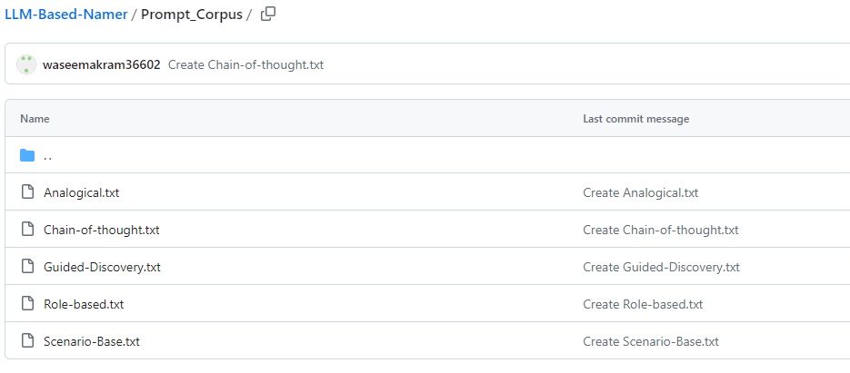
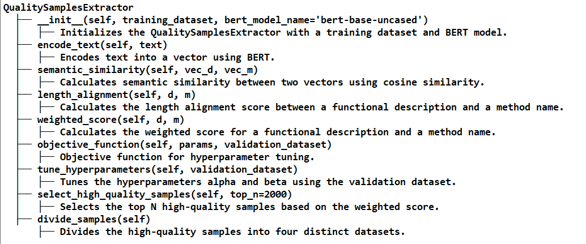
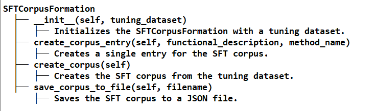
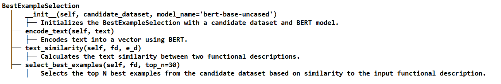
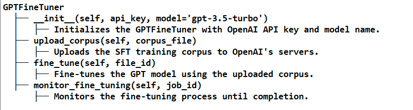
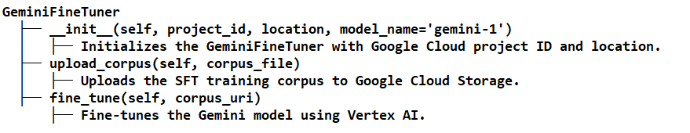
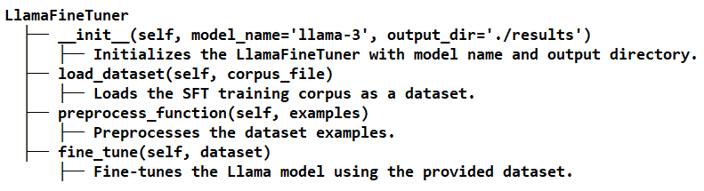
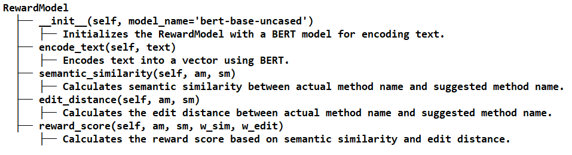
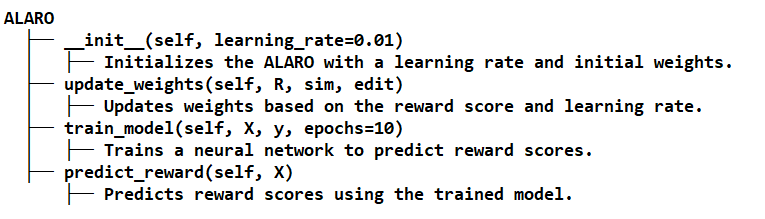
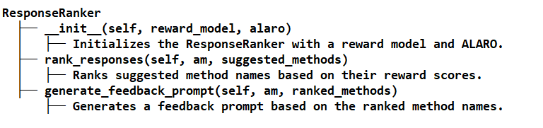

# Replication package for the paper: "A Cross-Language Approach to Recommending Method Names According to Functional Descriptions"

# Introduction:
This paper introduces a novel approach to automatically suggesting high-quality Java method names using large language models (LLMs). Leveraging LLMs' advanced understanding capabilities for natural language descriptions of method functionalities, this approach introduces an algorithm called LangInsightCraft to generate context-enriched prompts that align generated names with established naming conventions, enhancing code readability and maintainability.
# Datasets:
There are two datasets are used to evalatute the approach
- [English Dataset:](https://github.com/waseemakram36602/LLM-Based-Namer/tree/main/Datasets/English-Dataset) Method Names with English Functional Descriptions (Dataset of Baseline).
- [Chinese Dataset:](https://github.com/waseemakram36602/LLM-Based-Namer/tree/main/Datasets/Chinese-Dataset) Method Names with Chinese Functional Descriptions. The Dataset organized from [Java 11 API Reference](https://www.apiref.com/java11-zh/java.base/module-summary.html)
- [Unseen Dataset:](https://github.com/waseemakram36602/LLM-Based-Namer/tree/main/Datasets/UnseenData) Method Names with Chinese Functional Descriptions from offline private dataset. 
Each dataset is crucial for training and evaluating the models to ensure they perform effectively across linguistic boundaries.
# BaseLines
## Deep Learning-based Baseline

## Large Language Model-based Baselines

Included in the "[Prompt Corpus](https://github.com/waseemakram36602/LLM-Based-Namer/tree/main/Prompt_Corpus)" folder is a carefully curated corpus of prompts, comprised of text files, designed to enhance the performance of ChatGPT in accurately generating Java method names based on functional descriptions. These prompts are crafted to elicit precise and contextually relevant responses from the model, adhering to a well-designed template that aligns with the naming conventions and requirements specific to Java methods.

#Source-Code
Source code of our approach available in Source code folder
#Class Hierarchy
mNamer

- mNamer Class: Main class to handle the entire process, including loading datasets, extracting quality samples, generating prompt templates, fine-tuning models, generating in-context prompts, and ranking responses.

- QualitySamplesExtractor Class: Handles extracting high-quality samples, calculating similarity scores, and tuning hyperparameters.

- SFTCorpusFormation Class: Forms the SFT corpus by creating JSON entries and saving them to a file.

- BestExampleSelection Class: Selects the best examples from the candidate dataset based on text similarity.

- InContextPromptGenerator Class: Generates in-context prompts by integrating functional descriptions and best examples into the prompt template.

**GPTFineTuner Class: Handles fine-tuning the GPT model using OpenAI's API.**
- Fine-tuning GPT-3.5-Turbo involves a few steps, including preparing your dataset, creating a fine-tuning job, and then using the fine-tuned model. Here is a detailed guide to walk you through the process:
- Prerequisites:
OpenAI Account: Ensure you have an OpenAI account with API access.
API Key: Obtain your API key from the OpenAI dashboard.
Python Environment: Set up a Python environment with necessary libraries (openai).

**Fine-tuning of Gemini on Google Cloud's Vertex AI involves several steps**:
- Including setting up your environment, preparing your data, configuring the fine-tuning process, and executing the fine-tuning job. Here’s a detailed guide to help you through the process:
- Prerequisites
Google Cloud Account: Ensure you have a Google Cloud account and project set up.
Vertex AI API Enabled: Enable the Vertex AI API in your Google Cloud project.
IAM Roles: Make sure you have the necessary IAM roles assigned, such as Vertex AI Admin and Storage Admin.
Python Environment: Have a Python environment set up with the necessary libraries installed (google-cloud-aiplatform, pandas, transformers).
  

**LlamaFineTuner Class:**
Handles fine-tuning the Llama model using the Hugging Face Transformers library.
- Fine-tuning a language model like LLaMA 3 on the Hugging Face platform involves several key steps. This guide will take you through the process, from setting up your environment to preparing your data and executing the fine-tuning.

- Prerequisites
Hugging Face Account: Ensure you have a Hugging Face account.
Hugging Face Token: Obtain an access token from your Hugging Face account settings.
Python Environment: Set up a Python environment with the necessary libraries (transformers, datasets, accelerate).

- RewardModel Class: Calculates semantic similarity, edit distance, and reward scores for method names.

- ALARO Class: Dynamically adjusts weights for reward optimization using a neural network.

- ResponseRanker Class: Ranks suggested method names based on reward scores and generates feedback prompts.

# [RNN-Attn-Copy (Baseline Model):]([https://github.com/propaki/Automethod/tree/main/Source-Code/RNN-Attn-Copy.ipynb](https://github.com/waseemakram36602/LLM-Based-Namer/tree/main/Baseline_Code))
We meticulously reproduced and implemented the baseline model in "[Source-Code](https://github.com/waseemakram36602/LLM-Based-Namer/tree/main/Baseline_Code)", which is a [RNN-Attn-Copy](https://github.com/waseemakram36602/LLM-Based-Namer/blob/main/Baseline_Code/RNN-Att-Copy.ipynb) equipped with both attention and copying mechanisms. This advanced architecture was chosen as our benchmark for assessing the performance of alternative models due to its proven prowess in sequence-to-sequence translation tasks and its exceptional ability to grasp contextual nuances within sequences.

# mNamer
## Example usage
if __name__ == "__main__":
    mnamer = mNamer(train_file='java_train.csv', test_file='java_test.csv', valid_file='java_valid.csv')
    mnamer.run()
    
This snippet gives a clear, step-by-step guide for users to replicate the study, ensuring they understand how to set up their environment correctly. Make sure to include any additional specific instructions or prerequisites needed directly in your README or linked documentation to assist users further.
git clone https://github.com/waseemakram36602/LLM-Based-Namer.git

fine-tuned ready to chat ChatGPT extention availabe at [Mnamer](https://chat.openai.com/g/g-T58v7ELEM-mnamer)
The source code is the centerpiece of this repository, showcasing the application of BERT-based semantic model for both Semantic Driven Preprocessing and BERT-based RLHF in Postprocessing for LLMs to improve its method naming capabilities. This model represents a significant advancement in the field of automated method naming.

Getting Started
To get started with mNamer:
Install the required dependencies: pip install -r requirements.txt
Follow the instructions in the usage_instructions.md file for detailed steps on how to train and evaluate the models using the provided datasets and prompts.
Contribution
Contributions to LLM-MethodNamer are welcome. If you have suggestions for improvement or want to report bugs, please open an issue or submit a pull request.
